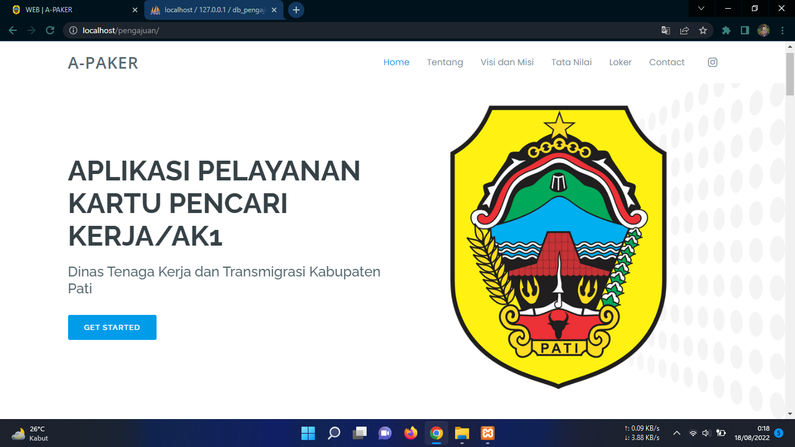
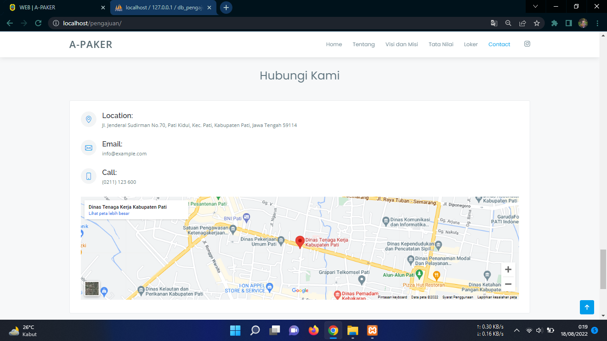
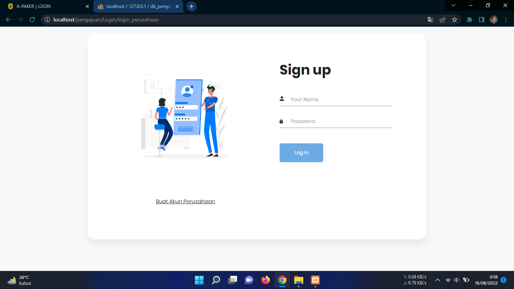
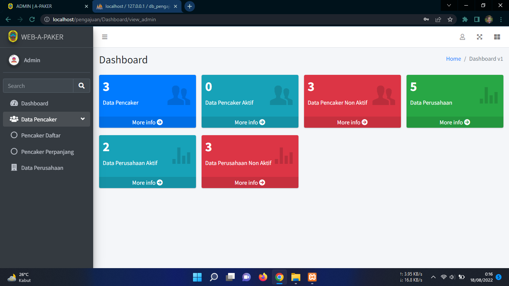

# Tampilan Aplikasi Kartu Pencari Kerja

## Aplikasi Pengajuan Kartu Pencari Kerja/AK1
Aplikasi pelayanan kartu pencari kerja berbasis web ini dibuat dengan menggunakan bahasa pemrogaman php dan framework codeigniter serta juga dilengkapi dengan database yang digunakan aplikasi ini yaitu mysql. Aplikasi pelayanan kartu pencari kerja berbasis web yaitu sebuah aplikasi system informasi yang dapat dimanfaatkan oleh user untuk mengajukan pembuatan kartu pencari kerja atau yang biasa disebut dengan kartu kuning. Aplikasi ini juga sudah dilengkapi dengan fitur login multi user.

## Fitur Aplikasi :

- Login Multi User
- Halaman FrontEnd
- Lowongan Pekerjaan
- Registrasi User
- Dashboard
- From Pengajuan
- Daftar Pencari Kerja
- Data Perusahaan
- Ganti Password
- Logout

## Instalasi :

- Download dan instal aplikasi xampp di laptop/pc.
- Ekstrak file menggunakan aplikasi WinRAR (password RAR terdapat dalam Video).
- Copy folder pengajuan, lalu paste kedalam folder htdocs dalam folder xampp.
- Aktifkan Apache dan MySQL pada xampp.
- Buka browser, lalu buka alamat localhost/phpMyAdmin.
- Buat database baru dengan nama db_pengajuan.
- Import database aplikasi kedalam database db_pengajuan.
- Jalankan project dengan klik localhost/pengajuan/Login/login_perusahaan.
- Login Admin dengan Username : admin dan password : admin.

